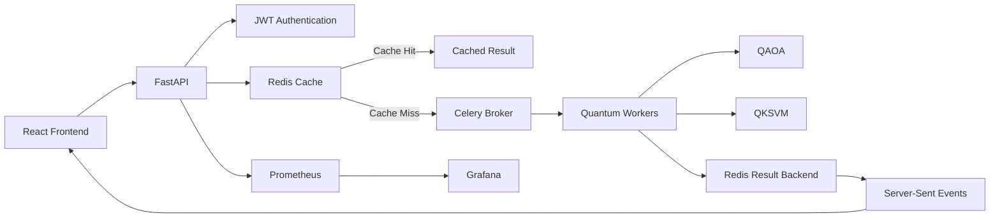

# Hybrid Quantum Machine Learning Framework for Multi-Objective Electric Vehicle Battery Pack Design Optimization

A production-oriented distributed quantum computing application that leverages hybrid quantum-classical algorithms (QAOA and QKSVM) to optimize EV battery pack designs across multiple objectives such as weight, cost, capacity, and thermal efficiency.

## Key Features
- **Quantum Optimization**: Employs the Quantum Approximate Optimization Algorithm (QAOA) for finding Pareto-optimal configurations.
- **Quantum Kernel Machine Learning**: Utilizes Quantum Kernel Support Vector Machines (QKSVM) for predictive performance modeling.
- **Asynchronous Task Processing**: Celery distributed workers handle computationally intensive quantum simulations.
- **Caching**: Sub-50ms deterministic Redis caching deduplicates expensive repeated quantum simulations.
- **Secure Telemetry Streaming**: Server-Sent Events (SSE) provide real-time quantum convergence metrics directly to the browser.
- **Log Sanitization Middleware**: Automatically redacts sensitive proprietary chemistry ratios, API keys, and Quantum statevectors before streaming to the client.
- **Authentication**: JWT-based Role-Based Access Control (RBAC) securely protects execution endpoints.
- **Observability**: Built-in Prometheus metrics and Grafana dashboards for latency and throughput tracking.
- **Docker Deployment**: Clean, microservice-oriented topology connecting 7 isolated containers.

## Architecture



## Technology Stack

| Layer | Technologies |
| --- | --- |
| **Frontend** | Next.js 14 (App Router), React, TailwindCSS, Framer Motion, XTerm.js |
| **Backend API** | FastAPI, Pydantic, Server-Sent Events (SSE) |
| **Quantum Engine** | Qiskit (1.2+), Qiskit-Aer, Qiskit-Optimization |
| **Task Queue** | Celery |
| **Datastore / Cache** | Redis, PostgreSQL, SQLAlchemy |
| **Observability** | Prometheus, Grafana |
| **Deployment** | Docker, Docker Compose |

## System Flow
1. **User Authentication**: Client authenticates via OAuth2PasswordBearer to receive a JWT.
2. **Request Validation**: The FastAPI router validates constraints on battery parameters using Pydantic.
3. **Cache Lookup**: Redis checks if this exact multidimensional problem has been solved before.
4. **Cache Hit/Miss**: On hit, returns sub-50ms response. On miss, task routes to Celery.
5. **Celery Dispatch**: Background worker unqueues the parameter payload.
6. **Quantum Execution**: The backend invokes Qiskit `StatevectorSampler` primitives for QAOA/QKSVM logic.
7. **Result Storage**: Optimizations are tracked persistently in the SQL database and temporarily in Redis.
8. **Real-Time Status Update**: The Celery worker updates `AsyncResult.state`, streamed securely via SSE.
9. **Frontend Visualization**: The Next.js interface presents an interactive Battery Blueprint and plots the multi-objective loss topology.

## Project Structure
```
EV_Battery_Quantum/
├── frontend/           # React dashboard UI
├── src/
│   ├── api/            # FastAPI routes, websockets, and JWT auth
│   ├── optimization/   # QAOA and NSGA-II solvers
│   ├── quantum_ml/     # QKSVM and Re-uploading VQC models
│   ├── services/       # Core business logic and caching wrappers
│   └── worker/         # Celery task definitions and app configuration
├── tests/              # Pytest suite
├── docker-compose.yml  # Microservice orchestrator
├── requirements.txt    # Python dependencies
└── .env.example        # Environment variable template
```

## Installation

```bash
git clone <repository-url>
cd EV_Battery_Quantum
```

### Environment Setup
Copy the template and configure your secrets:
```bash
cp .env.example .env
# Edit .env and supply a secure SECRET_KEY
```

### Backend Installation (Local)
```bash
uv venv .venv
source .venv/bin/activate
uv pip install -r requirements.txt
```

### Frontend Installation (Local)
```bash
cd frontend
npm install --legacy-peer-deps
npm run dev
```

## Running Locally

1. **Start Redis and Postgres** (Recommended via Docker):
```bash
docker compose up -d redis db
```
2. **Start Celery Worker**:
```bash
celery -A src.worker.celery_app worker --loglevel=info
```
3. **Start FastAPI Application**:
```bash
uvicorn src.api.main:app --reload --port 8000
```
4. **Start Frontend Development Server**:
```bash
cd frontend
npm run dev
```

## Running with Docker
To build and launch the complete stack of 7 microservices in an isolated network:
```bash
docker compose up --build -d
```
The API will be available at `http://localhost:8000` and the UI at `http://localhost:3000` (or as configured).

## API Documentation
Once running, interactive API documentation is available at:
- Swagger UI: `http://localhost:8000/docs`
- ReDoc: `http://localhost:8000/redoc`

## Testing
To run the automated test suite covering the FastAPI endpoints and Quantum modules:
```bash
SECRET_KEY="test" ALLOWED_ORIGINS="*" PYTHONPATH=. .venv/bin/pytest tests/
```

## Benchmarking
The caching mechanism achieves sub-50ms response times for duplicate configurations, while cold starts depend on the quantum circuit depth.
> **Note**: Benchmark results depend on hardware, container network overhead, system load, and Redis locality.

## Monitoring
Metrics are exposed natively:
- **Prometheus** scrapes the FastAPI application at `/metrics`.
- **Grafana** visualizes these metrics on port 3000 (if exposed) via pre-provisioned dashboards.

## Quantum Implementation
- **QAOA**: Used to find approximate solutions to the Quadratic Unconstrained Binary Optimization (QUBO) formulation of the discrete battery configuration search space.
- **QKSVM**: Provides an alternative non-linear feature map approach to classify high-performance parameter boundaries.
- **Simulation**: Due to current NISQ hardware constraints, models are executed using local classical simulation (`qiskit-aer` and `StatevectorSampler`).

## Known Limitations
> Local simulation of large quantum optimization problems can become computationally expensive because classical simulation requirements grow rapidly with circuit width and problem size. Larger QUBO instances (especially > 20 variables) may therefore cause significant CPU and memory pressure. This implementation is intended primarily for small-to-medium instances in a local academic environment.

## Future Improvements
- IBM Quantum Runtime integration for cloud-based true quantum execution.
- Problem decomposition (e.g., QAOA-in-QAOA or cutting-tensor networks) for larger instances.
- Smarter cache eviction policies (e.g., LRU over TTL).
- Advanced observability with OpenTelemetry distributed tracing.

## Security
The application uses JWT authentication via `OAuth2PasswordBearer`. The `SECRET_KEY` must be configured securely in production via `.env`. Cross-Origin Resource Sharing (CORS) is explicitly limited to configurable origins to prevent unauthorized web access.

## License
MIT License
